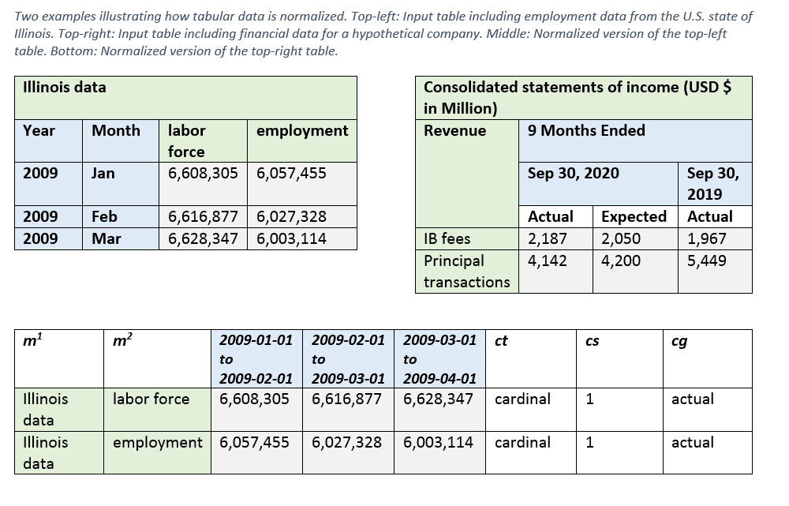

# SFinX: Standardized FINancial eXtractions
Tabular structures house massive amounts of data. In an enterprise setting, the diversity and variety of these structures can make it difficult to standardize, analyze, compare, or unify them. Oftentimes technology teams build custom pre-processing pipelines that can transform and standardize a limited subset of these datasets, but these pipelines can rarely scale to other datasets with different format and structure. Such efforts, when repeated for each individual dataset, business unit, and function, can prove to be extremely costly.  
SFinX is a tool that automatically standardizes such data into a unified format than can be reused in any downstream pipeline. The method works on three conditions:
1.	The data is numeric/quantitative
2.	Each datapoint reflects the value of a metric or a set of metrics
3.	Each datapoint is tied to a period 

The top segment of the table below provides two examples of such tabular data. The numeric datapoints have been shaded grey, the metrics have been shaded green and the periods have been shaded blue. Other examples of such datasets include financial earnings reports, market data, credit card transactions, budget reports, macroeconomic insights, and most other financial time-series datasets.

# Requirements
`python 3.7` or higher.

# How to use
1. `git clone <SFinX>`
2. `cd <SFinX>`
3. Add the current directory to [PYTHONPATH](https://docs.python.org/3/using/cmdline.html#envvar-PYTHONPATH)
   - Windows: `set PYTHONPATH=.`
   - *nix/Mac:  `export PYTHONPATH=.`
4. `pip install -r requirements.txt`
5. `python sfinx/main.py --input /path/to/input/file.xlsx --output /path/to/output.[tsv|json]`

The program expects Excel inputs and will output in either tsv or json format depending on the file extension
used for the output file.

There are some example input files within the project that you can run:
 - `python sfinx/main.py --input examples/sfinx_example_1_input.xlsx --output output.json`
